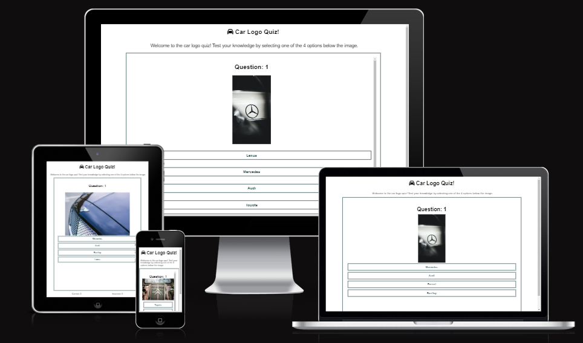
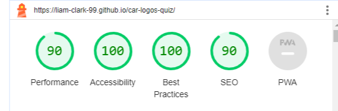

# Car Logo Quiz

Welcome to the Car Logo Quiz, an exciting interactive game that challenges your knowledge of car brands! Are you a car enthusiast? Do you think you can recognize different car logos with just a glance? Put your skills to the test and enjoy this fun-filled quiz designed to challenge your automotive expertise.

How to Play:
In this quiz, you'll be presented with various car logos, and your task is to guess the brand associated with each logo. Click on the interactive buttons to submit your answers and see how many you can get right! Whether you're a car aficionado or just looking for a fun way to pass the time, this quiz is perfect for everyone.

## Features

- Random selection of car logos for each question.
- Interactive answer buttons for user input.
- Dynamic score tracking for correct and incorrect answers.
- Responsive design for various screen sizes.

## Testing

- I used W3C HTML validator to ensure all of my HTML code was error free
- I used W3C CSS validator to ensure that all of my CSS code was error free
- I used JSHint to ensure that there were no major errors in my JavaScript code
- I used lighthouse in developer tools to anayse performance and accessibility
- I tested the deployed website on different web browsers to ensure consistent performance
- I used the common breakpoints to ensure the formatting was adjusted to different screen sizes. 
  
  

  ## Deployment

The Car Logo Quiz website was deployed on GitHub pages using the folllowing steps:

1. Navigate to the settings tab of the GitHub repository
2. Select the Master Branch from the source section drop down menu
3. The link to the live website is then provided

The link to the live deployment can be found [here:](https://liam-clark-99.github.io/car-logos-quiz/)

## Future Improvements

- I would have liked to add a timer to the quiz to create a sense of urgency and apply some pressure to thr user
- The quiz could have benefitted from a larger database of logos to be chosen to have more variety
- More styling would be a big improvement to make it more aesthetically pleasing

## Credits

This project was loosely inspired by The Code Institute's Love Maths project.

Many of the javascript coding was influenced by the supporting material from Code Institute and the learning material provided on [MDN Web Docs](https://developer.mozilla.org/en-US/).

Developer tools and ChatGPT were used on occassion to efficiently help debug code and identify syntax errors in the JavaScript code. 